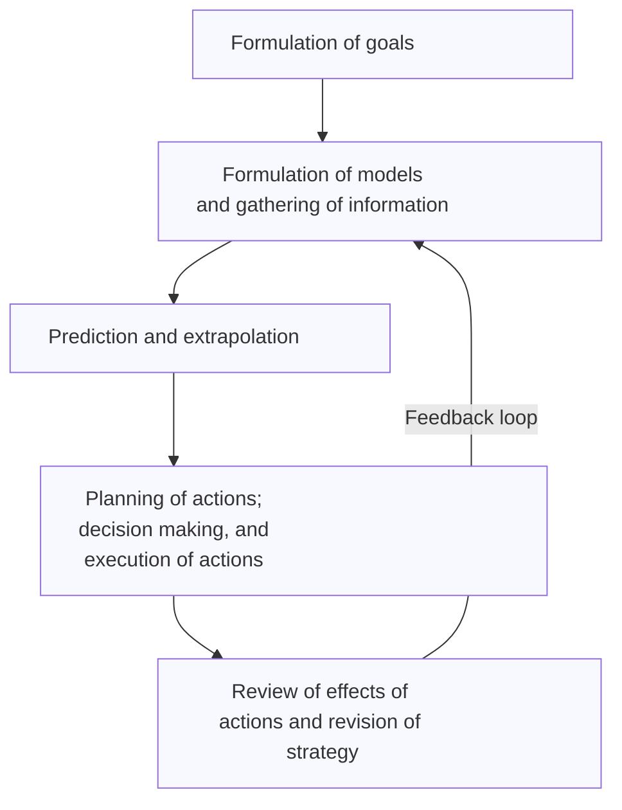

# the logic of failure

not what i thought it would be, but better. a very strong book recommendation for systems thinking. really interesting ideas of how to use video games / virtual worlds to understand how and where people fail at thinking in systems.

- chapter 1
  - they discuss a simulated game where used can choose to solve particular problems to reach goals (e.g., increase the population of sheep in a simulated herding economy)
  - those who were good at guiding these worlds made more decisions, adn 'recognized early where Greenvale's real problems lay and attacked them first'
  - both good and bad players proposed hypotheses, but the bad players failed to disprove any hypotheses they raised. the good plays updated their hypotheses in response to new information
  - good players asked more _why_ questions and were interested in causal relationships more often than the bad players
  - bad participants would often jump around from one problem to the next without making a lot of progress
  - the good participants focused on the right things and _continued to focus on these things_ over time (i.e., they didn't beome distracted)
  - the interpretation is that the bad players had trouble tolerating uncertainty: "a refusal to recognize one's impotence is hard and helplessness and a tendency to seek refuge in certainty and security". **people often solved problems they knew they could solve, without regard to whether these were the right problems to solve.**
  - he argues that when we are faced with understanding or regulating system, we respond to the _situation_ and not the _process_ / differentials that show how the situation is unfolding / changing. 
- chapter 2
  - his model for 'steps in planning and action' looks like this:

  - 

themes:

- the need to tolerance uncertainty or attack a problem you are ignorant about how to solve.
- people are more likely to focus on problems they like to solve or have solved in the past, regardless of whether those problems are actually the most important to focus on