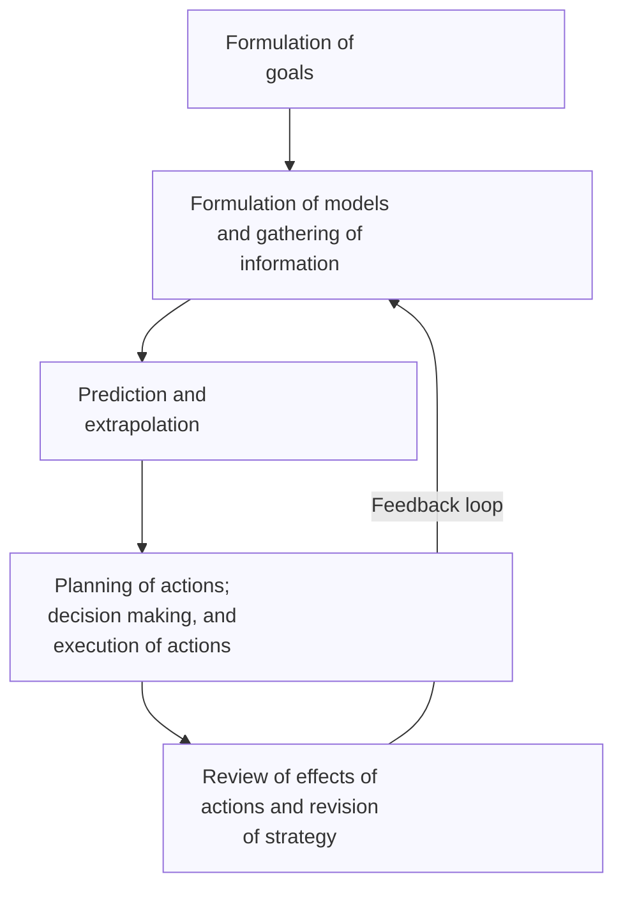

# the logic of failure

not what i thought it would be, but better. a very strong book recommendation for systems thinking. really interesting ideas of how to use video games / virtual worlds to understand how and where people fail at thinking in systems.

#### the intro 

  - they discuss a simulated game where used can choose to solve particular problems to reach goals (e.g., increase the population of sheep in a simulated herding economy)
  - those who were good at guiding these worlds made more decisions, adn 'recognized early where Greenvale's real problems lay and attacked them first'
  - both good and bad players proposed hypotheses, but the bad players failed to disprove any hypotheses they raised. the good plays updated their hypotheses in response to new information
  - good players asked more _why_ questions and were interested in causal relationships more often than the bad players
  - bad participants would often jump around from one problem to the next without making a lot of progress
  - the good participants focused on the right things and _continued to focus on these things_ over time (i.e., they didn't beome distracted)
  - the interpretation is that the bad players had trouble tolerating uncertainty: "a refusal to recognize one's impotence is hard and helplessness and a tendency to seek refuge in certainty and security". **people often solved problems they knew they could solve, without regard to whether these were the right problems to solve.**
  - he argues that when we are faced with understanding or regulating system, we respond to the _situation_ and not the _process_ / differentials that show how the situation is unfolding / changing. 

#### the model 

  - his model for 'steps in planning and action' looks like this, rendered like shit:

  - the rest of the book tackles each of these in turn

#### setting goals

  - most people are concerned with solving the goal in front of them, and fail to consider what other side-effects or other problems solving their problem might entail
  - he basically argues to pursue postures that allow for high optionality, since if your choices end up having terrible consequences, you can pivot
  - he also argues that when solving a problem, we should be explicit about the features of the current situation we want to retain. e.g., you might want to run a marathon, but training is a huge stress on your body and you risk getting injured. so a better formulation would be something like 'i want to train for a marathon as long as i remain healthy': this way you are explicit about what you want to leave unchanged
  - he talks a good team about imprecise goals like 'improve the well-being of citizens'. if you don't break that goal into partial goals, you risk what he calls 'repair service behavior': you go in search of problems to solve, regardless of how important they are to solve. often we gravitate to problems that we know how to solve.
  - "without concrete goals, there are no criteria that can be used to judge whether progress is in fact being made."
  - "Max Horkheimer has this degenerative process in mind when he writes: 'Scientists bow down to the 'concretism' of a mode of understanding that finds the works of a clock more interesting than the time the clock measures. They have all become mechanics, as it were. In their theories, they invest all their love in those things that they can deal with free of doubt. They think they can find security in things that seem absolute to them and that protect them from all contradiction. They are infatuated with neat means, methods, and techniques and patholocally underestimate, or forget, what they think themselves no longer capable of and what all of us at one time or another have hoped to achieve in the way of insight.'"
  - "contradictory rules are the rule, not the exception, in complex situations."
  - he also talks about an odd phenomenon of 'goal inversion.' when we can't solve a goal, we give up, and sometimes pursue the opposite of the original goal

#### information and models

- this chapter is a really good overview of systems thinking. he argues that we can't just understand the components of the system, but we have to understand the _relationship_ between all components, the _nature_ of those interactions, which can lead us to understanding which components have different roles in the system (e.g., an indicator variable, or buffer, or critical variable)
- he also argues for the use of analogy / metaphor for building hypotheses or asking the right questions. this is especially important if you have decided to solve a problem in an unfamiliar domain in which you aren't familiar with how to go about solving the problem
- he also argues that different problems require different levels of detail. part of judgement is figuring out which level of detail is appropriate for a given problem
- there's an interesting section in the book about 'reductive hypothesis.' these hypothesis take the form a systems diagrams and usually tie a lot variables to a single variable (like 'well-being'). the individual links might be correct, but the overall articulation of the system is not. these sorts of hypotheses are satisfying because they encompass the entire system and are easy to understand, however. this is why reductive hypothesis are so prevalent and popular. "to the ignorant, the world looks simple."
- quote from Graf von Moltke: "Strategy is a system of makeshifts...it is...the further elaboration of an original guiding idea under constantly changing circumstances. It is the art of acting under the pressure of the most demanding conditions...this is why general principles, rules derived from them, and systems based on these rules cannot possibly have any value for strategy."
- a fascinating idea: "sometimes there is probably even positive feedback between the amount of information we have and our uncertainty." definitely something I've felt before.

#### time sequences

- there's a lot in here about how poor humans are at extrapolating, especially about non-linear growth, because we tend to assume things will be linear, or we can't quite intuit non-linearities or network effects
- when we interpret time-related trends in the real world, we need to consider: limited resources, head starts, and transient effects
- there's some interesting stuff in here about how growth rates of disease tend to artificially inflated early on
- in situations where feedback in infrequent and where the intervals between action and feedback are longer => breeding ground for rituals
- in complex systems, people tend to overgeneralize from their local experience, to ritualize, and believe that there is no rational principle at work, and fall into a form of learned helplessness
- most catastrophes have been a long time in the making
- "try to understand the internal dynamics of the process. make notes on those dynamics so that you can take past events into account and not be at the mercy of the present moment. try to anticipate what will happen."

#### planning

- "planning consists of examining the consequences of individual actions, then stringing individual actions together into sequences and examining the possible connections of these sequences of action"
- "in planning, we develop a more or less long chains of imagined actions. These chains consist of individual links that, if they are complete, each comprise three elements: a conditioned element, an action element, and a result element."
- "the fact that goals are often unclear may well explain why people show little spontaneous enthusiasm for reverse planning."
- the most important method for expanding a "problem sector" is _thinking by analogy_
- in very complex situations, the most reasonable strategy is to plan with only a rough outline and delegate as many local decisions as possible to subordinates
- super precise planning is often a product of insecurity / inability to deal with the fact that you don't know, can't anticipate everything
- good problem solvers tend to take circumstances into account / think conditionally, as opposed to have absolutist views of the world
- **"activity may foster an illusion of competance"**

#### so what do we do now?

- he argues that there are no hard-and-fast rules about the right thing to do when faced with complex scenarios. in some cases, the best course of action is the think, not act; in some cases, it's the reverse. a lot comes down to (1) understanding different frameworks that exist for solving the problem and then (2) selecting the one that makes the most sense for that problem in that moment. it's really easy to focus on collecting and applying these frameworks, but much harder to exercise the judgement about when it's appropriate to use each one

themes:

- the need to tolerance uncertainty or attack a problem you are ignorant about how to solve.
- people are more likely to focus on problems they like to solve or have solved in the past, regardless of whether those problems are actually the most important to focus on